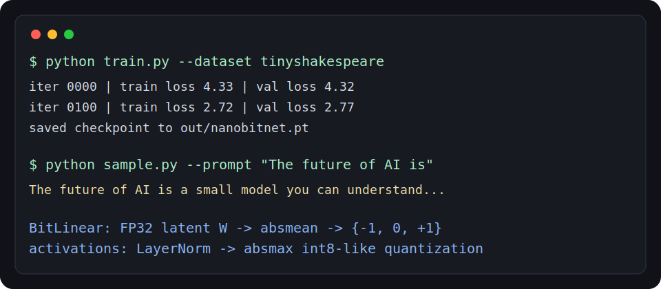
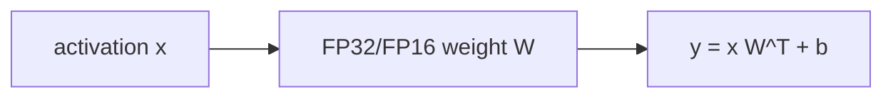
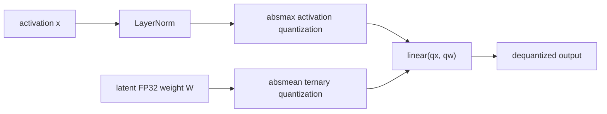
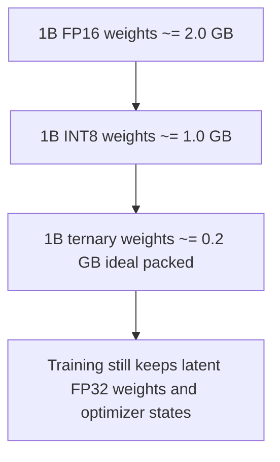

# nanoBitNet: BitNet b1.58 in pure PyTorch



`nanoBitNet` is a small, readable implementation of the core BitNet b1.58 idea:
replace Transformer linear projections with `BitLinear`, where latent full-precision
weights are quantized on the forward pass to ternary values `{-1, 0, +1}`.

This is the educational repo. It is written so a researcher, student, or local-LLM
engineer can understand 1.58-bit training in one afternoon. If you want optimized
CPU/GPU inference kernels, use Microsoft's official BitNet project.

## Read This Before Benchmarking

`nanoBitNet` is expected to be slower than an ordinary FP32 PyTorch model on CPU.
That is not a BitNet failure; it is the cost of showing the mechanics in plain
PyTorch.

Every `BitLinear` forward pass in this repo does:

```text
LayerNorm
+ activation absmax quantization
+ weight absmean quantization
+ ordinary floating-point torch linear
```

The weights are ternary in the forward math, but they are not packed into
1.58-bit buffers and they do not run through custom ternary matrix-multiply
kernels. Real BitNet inference speed requires the optimized kernels and model
formats used by `bitnet.cpp`.

## Quick Start

```bash
pip install -r requirements.txt
python train.py --dataset tinyshakespeare
python sample.py --prompt "The future of AI is"
```

For a fast smoke run:

```bash
python train.py --dataset tinyshakespeare --max-iters 20 --eval-interval 10 --device cpu
python sample.py --prompt "The future of AI is" --device cpu --max-new-tokens 80
python bench.py --device cpu --steps 20
```

## Why This Exists

BitNet introduced `BitLinear` as a drop-in replacement for `nn.Linear` so low-bit
weights can be trained from scratch rather than only compressed after training.
BitNet b1.58 extends the idea to ternary weights, giving three possible weight
values and therefore `log2(3) ~= 1.585` bits of information per weight.

This repo focuses on the moving parts that matter:

- `BitLinear`: latent FP32 weights, ternary forward weights, STE gradients.
- Absmean weight quantization: scale weights by their average absolute value.
- Absmax activation quantization: map normalized activations into an int8-like range.
- Tiny GPT-style language modeling: train and sample from a small character model.
- Benchmarks and diagrams: see what changed versus normal linear layers.

It does not implement packed ternary kernels, model-parallel group quantization,
or production inference formats. That boundary is intentional.

## The One Layer

The main idea lives in about 40 lines inside [nanobitnet.py](nanobitnet.py):

```python
class BitLinear(nn.Module):
    def forward(self, x):
        x = self.norm(x)
        x_q = quantize_activation_absmax(x, bits=self.activation_bits)
        w_q = quantize_weight_absmean(self.weight)
        return F.linear(x_q, w_q, None)
```

The real implementation keeps the scale factors explicit and uses a
straight-through estimator so gradients update the latent high-precision weights.

## Diagrams

Normal linear layer:



BitLinear in this repo:



Memory intuition:



## Benchmark Snapshot

Run the benchmark on your own machine:

```bash
python bench.py --device cpu --steps 50
```

Expected shape of the output:
| model | params | ideal bits/weight | ideal weight storage | forward ms |
|---|---:|---:|---:|---:|
| fp32 tiny GPT | 819,712 | 32.00 | 3.28 MB | 12.86 |
| fp16 tiny GPT | 819,712 | 16.00 | 1.64 MB | 513.65 |
| BitNet-style ternary GPT | 819,712 | 1.58 | 0.16 MB | 70.14 |

Note: training checkpoints store latent weights in PyTorch tensors.
The 1.58-bit number is the ideal packed ternary forward representation.


Important: PyTorch still stores the latent weights as FP32 tensors during training.
The 1.58-bit number describes the quantized forward/inference representation, not
the raw size of this educational training checkpoint.

On CPU, the BitNet-style row may be slower than FP32 because it pays quantization
overhead and then still calls PyTorch's normal floating-point linear primitive.
The benchmark is included to make that tradeoff visible, not to claim production
inference speed.

## Real Inference With bitnet.cpp

Yes, this project can point users to `bitnet.cpp` for real BitNet inference, but
that is a separate execution path:

- Train or download a supported BitNet b1.58 model.
- Convert or obtain it in the GGUF format expected by `bitnet.cpp`.
- Run it through Microsoft's optimized CPU/GPU kernels.

Microsoft's BitNet README describes `bitnet.cpp` as the official inference
framework for 1-bit LLMs and documents optimized CPU/GPU kernels, supported
models, `.safetensors` conversion, and benchmark scripts.

What `nanoBitNet` does today:

- teaches the BitNet b1.58 layer mechanics in PyTorch
- trains a tiny character model for inspection
- shows why the 1.58-bit representation exists

What `nanoBitNet` does not do today:

- export this tiny character model to a supported `bitnet.cpp` GGUF architecture
- implement packed ternary kernels
- claim `bitnet.cpp` speed from PyTorch `F.linear`

A good future extension is `export_bitnet_cpp.py`, but it should target a
`bitnet.cpp`-supported architecture and tokenizer rather than this tiny
character-level teaching model.

## Paper Validation

The implementation follows the public BitNet papers on these points:

- BitNet introduces `BitLinear` as a replacement for `nn.Linear` when training
  low-bit weights from scratch.
- BitNet b1.58 constrains each weight to `{-1, 0, +1}` during the forward pass.
- The ternary weights use absmean quantization: divide by average absolute weight,
  round, and clip into `[-1, 1]`.
- Activations use absmax quantization, commonly with 8-bit activations.
- Training uses a straight-through estimator because rounding and clipping are
  not differentiable.
- Latent weights, gradients, and optimizer states remain high precision during
  training for stability.

Primary references:

- Wang, Ma, et al. "BitNet: 1-bit Pre-training for Large Language Models." JMLR,
  2025: https://jmlr.org/papers/v26/24-2050.html
- Ma, Wang, et al. "The Era of 1-bit LLMs: All Large Language Models are in
  1.58 Bits." arXiv, 2024: https://arxiv.org/abs/2402.17764
- Ma, Wang, et al. "BitNet b1.58 2B4T Technical Report." arXiv, 2025:
  https://arxiv.org/abs/2504.12285
- Microsoft BitNet, official inference framework for 1-bit LLMs:
  https://github.com/microsoft/BitNet
- PyTorch `linear` reference, used for the affine primitive:
  https://docs.pytorch.org/docs/stable/generated/torch.nn.functional.linear.html

## Repository Layout

```text
nanobitnet.py          # the model, BitLinear, quantizers, generation
train.py               # tiny character-level training loop
sample.py              # checkpoint sampling
bench.py               # simple forward-time and storage comparison
tests/                 # quantization and model smoke tests
assets/                # README visual
launch/                # posts, blog draft, launch checklist
```

## Launch Copy

> I built nanoBitNet: a minimal PyTorch implementation of BitNet b1.58.
>
> It is not optimized inference like bitnet.cpp; it is the readable version.
>
> The repo includes BitLinear, ternary weight quantization, tiny training,
> sampling, diagrams, benchmarks, and paper-validated notes.
>
> Goal: understand 1.58-bit LLMs in one afternoon.

## License

MIT.
